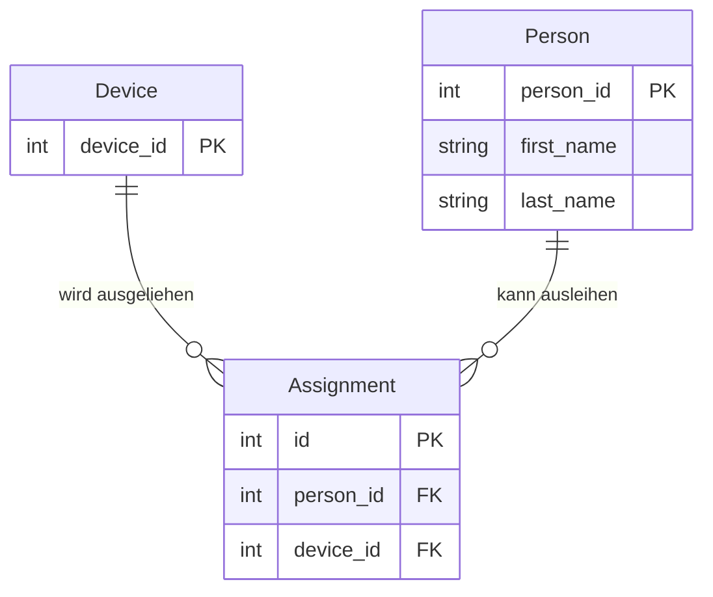

```mermaid
erDiagram
    Device ||--o{ Assignment : "wird ausgeliehen"
    Person ||--o{ Assignment : "kann ausleihen"

    Person {
        int person_id PK
        string first_name
        string last_name
    }

    Device {
        int device_id PK
    }

    Assignment {
        int id PK
        int person_id FK
        int device_id FK
    }
```
R1: Ein Gerät kann mehrfach ausgeliehen werden

R2: Eine Person kann mehrere Geräte ausleihen